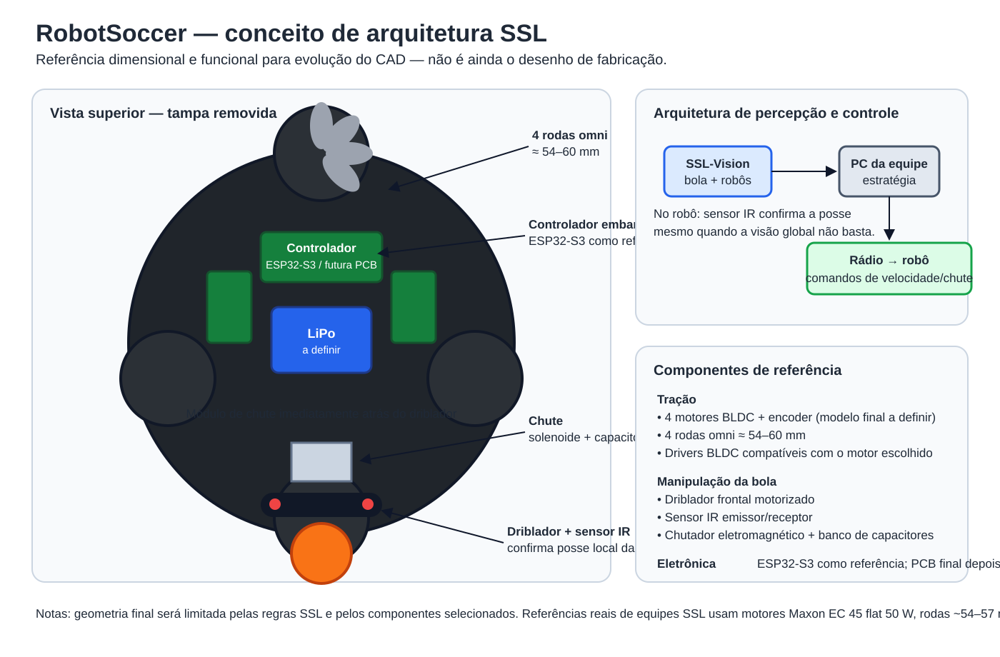

# RobotSoccer

Projeto de um robô de futebol omnidirecional inspirado na **RoboCup Small Size League (SSL)**, agora orientado por componentes reais, restrições de competição e uma arquitetura de controle compatível com visão global.

## Arquitetura atual

- envelope de projeto compatível com o limite SSL de **180 mm × 150 mm**;
- **4 rodas omni**;
- **4 motores BLDC com encoder**;
- driblador frontal motorizado;
- sensor IR para confirmação local da posse da bola;
- mecanismo de chute eletromagnético;
- controlador embarcado baseado inicialmente em **ESP32-S3**;
- posição global da bola e dos robôs fornecida pelo **SSL-Vision**;
- computador externo responsável por estratégia e envio de comandos ao robô.

> O desenho acima é uma referência de arquitetura, não ainda o CAD final de fabricação. O chassi definitivo será dimensionado ao redor dos componentes selecionados.

## Componentes de referência

| Subsistema | Referência |
|---|---|
| Tração | 4 × BLDC com encoder |
| Motor usado como referência por equipes SSL | Maxon EC 45 flat, 50 W, 18 V |
| Rodas | 4 × omni, aproximadamente 54–60 mm |
| Drivers | Drivers BLDC compatíveis com os motores escolhidos |
| Controle | ESP32-S3 DevKitC-1 no protótipo |
| Driblador | Rolete frontal motorizado |
| Sensor de bola | Emissor IR + receptor/fototransistor |
| Chute | Solenoide/atuador + banco de capacitores |
| Alimentação | LiPo, a dimensionar após definição dos motores |

**Importante:** o DRV8876 usado em um conceito anterior é para motor DC escovado e não será adotado como driver dos motores BLDC.

## Modelagem 3D

Os recursos paramétricos do Onshape continuam consolidados em:

`3D/Onshape/RobotSoccer_All.fs`

O arquivo será revisado quando forem fechados os componentes mecânicos e elétricos reais.

## Documentação

- [Arquitetura SSL e lista detalhada de componentes](docs/ARQUITETURA_SSL.md)
- [Desenho conceitual da arquitetura](docs/RobotSoccer_SSL_Concept.svg)
- [Modelo 3D anterior](docs/RobotSoccer_3D.svg)
